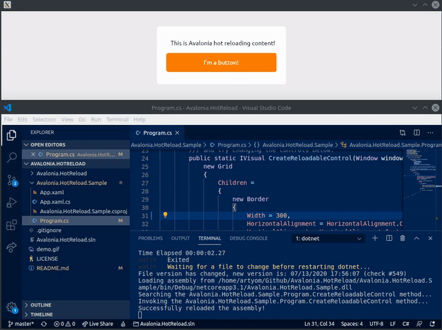

[](https://www.nuget.org/packages/Live.Avalonia) [](https://www.nuget.org/packages/live.Avalonia)   

# Live.Avalonia

`Live.Avalonia` is an experimental project which intends to make the hot reloading feature working in Avalonia-based applications. The core idea of this project was originally proposed by [@Pix2d](https://twitter.com/pix2d) during a discussion in Avalonia Telegram chat. Thanks to [@TirrKatz](https://twitter.com/TirrKatz) for their help in debugging the tooling!



In `Live.Avalonia`, we rely on `dotnet watch build` .NET Core facility to rebuild an Avalonia project from sources when any of the source files change. Then, we re-embed the updated controls into a simple Avalonia `Window`. `Live.Avalonia` could possibly save you a lot of time spent clicking 'Build & Run' in your IDE, or typing `dotnet run` in the console. Worth noting, that `Live.Avalonia` doesn't require you to install any particular IDE tooling™ — you can edit files even in [Vim](https://github.com/vim/vim), and the app will hot reload 🔥

### Getting Started

> **Warning** `Live.Avalonia` was not extensively tested, and is not guaranteed to work with every project setup, especially if you do some extraordiany stuff with weird MSBuild properties and your output assemblies. Use this tool at your own risk. Thank you for your flexibility.

> **Important Note** By default, `dotnet watch build` triggers the build only when any `.cs` file changes. In order to have live reload working for `.xaml` files too, add the following line to your `.csproj` file: `<Watch Include="**\*.xaml" />`. See the [`Live.Avalonia.Sample`](https://github.com/worldbeater/Live.Avalonia/blob/master/Live.Avalonia.Sample/Live.Avalonia.Sample.csproj#L16) project for more info.

[`Live.Avalonia`](https://www.nuget.org/packages/Live.Avalonia/0.1.0-alpha) is distributed via NuGet package manager:
```
dotnet add package Live.Avalonia
```
After installing the NuGet package, add the following lines to your `App.xaml.cs` file:
```cs
public class App : Application, ILiveView
{
    public override void Initialize() => AvaloniaXamlLoader.Load(this);

    public override void OnFrameworkInitializationCompleted()
    {
        // Here, we create a new LiveViewHost, located in the 'Live.Avalonia'
        // namespace, and pass an ILiveView implementation to it. The ILiveView
        // implementation should have a parameterless constructor! Next, we
        // start listening for any changes in the source files. And then, we
        // show the LiveViewHost window. Simple enough, huh?
        var window = new LiveViewHost(this, message => Console.WriteLine(message));
        window.StartWatchingSourceFilesForHotReloading();
        window.Show();

        base.OnFrameworkInitializationCompleted();
    }
    
    // When any of the source files change, a new version of the assembly is 
    // built, and this method gets called. The returned content gets embedded 
    // into the LiveViewHost window.
    public object CreateView(Window window) => new TextBlock { Text = "Hi!" };
}
```
Then, run your Avalonia application:
```
dotnet run
```
Now, edit the control returned by `ILiveView.CreateView`, and the app will hot reload! 🔥

### Retaining App State

As we discovered in [this Twitter thread](https://twitter.com/MihaMarkic/status/1283345704405082112), the state is retained, if you keep it in your [ViewModel](https://www.reactiveui.net/docs/handbook/view-models/) and pass it from `Window` to your `View` inside the `ILiveView.CreateView` method. So, if you are willing to keep app state the same after a hot reload, use the following `ILiveView.CreateView` implementation: 

```cs
public object CreateView(Window window) {
    if (window.DataContext == null)
        window.DataContext = new AppViewModel();

    // The AppView class will inherit the DataContext
    // of the window. The AppView class can be a 
    // UserControl, a Grid, a TextBlock, whatever.
    return new AppView();
}
```

