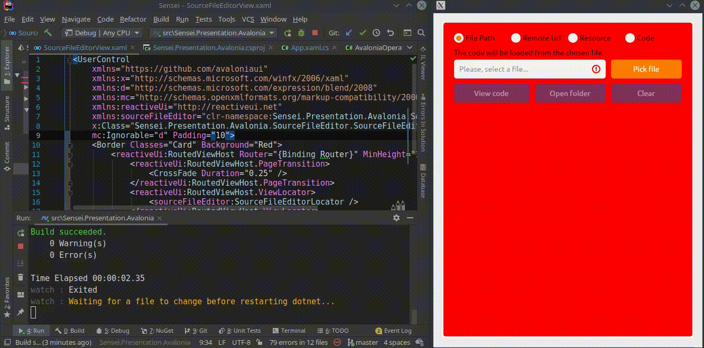

# Avalonia.HotReload

This repository demonstrates how to use the hot reload feature in your Avalonia applications. The core idea is to rely on `dotnet watch` for rebuilding the projects from sources when any of the source files change, and to re-embed the updated controls into the `Window` without any need to press the 'Run' button by hands multiple times. See the following demo gif to get more context:

### Getting Started

1. Install the [`Avalonia.ReactiveUI`](https://www.nuget.org/packages/Avalonia.ReactiveUI/) package into your Avalonia C# project
2. Copy-paste the [`AvaloniaReloadingWindow.cs`](./Avalonia.HotReload/AvaloniaReloadingWindow.cs) into your Avalonia C# project
3. Create the [`CreateReloadableControl`](https://github.com/worldbeater/Avalonia.HotReload/blob/master/Avalonia.HotReload.Sample/Program.cs#L24) static method in the `Program.cs` file:

```cs
// This method will be the hot-reloadable composition root of your Avalonia application.
// Remember to use this signature! Otherwise the things won't work.
public static object CreateReloadableControl(Window window) => new TextBlock { Text = "Ok" };
```

4. Instantiate the [`AvaloniaReloadingWindow`](./Avalonia.HotReload/AvaloniaReloadingWindow.cs) in your [`App.xaml.cs`](https://github.com/worldbeater/Avalonia.HotReload/blob/master/Avalonia.HotReload.Sample/App.xaml.cs#L12) file as such:

```cs
// Obtain the assembly of the project by doing typeof on any type from the assembly.
// Then, instantiate the reloading Window class by passing the current project
// assembly to it, as well as the logger. Then, show the window. Using multiple 
// reloading windows isn't currently supported.
var assembly = typeof(App).Assembly;
var window = new AvaloniaReloadingWindow(assembly, Console.WriteLine);
window.Show();
```

5. Done! Make some changes in what the `CreateReloadableControl`, press `Ctrl+S` and the app will hot-reload.
6. If you experience any issues, clone this repository and play with the `Avalonia.HotReload.Sample` project.

> **Important Note**: By default, `dotnet watch` tracks changes in `.cs` files only. In order to have hot-reload working with `.xaml` files, add the `<Watch Include="**\*.xaml" />` directive to your `.csproj` file. See the [project file](https://github.com/worldbeater/Avalonia.HotReload/blob/master/Avalonia.HotReload.Sample/Avalonia.HotReload.Sample.csproj) in the demo project for more context.

### Demo


